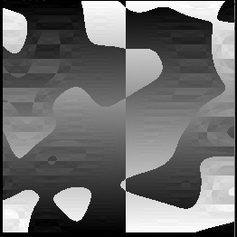
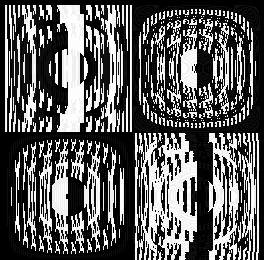

# Jene: A lightweight evolutionary art package for Java

Jene is a lightweight, extensible package for creating artistic images using
evolutionary algorithms in Java. Jene's algorithms and data structures are based
on Karl Sims' classic paper,
[Artificial Evolution for Computer Graphics](http://www.karlsims.com/papers/siggraph91.html).

Two sample applications are included, one that produces images, and another that
produces 3D parametric surfaces. Here are some sample results from each
application:

 

## Features

* Includes two applications to help get started quickly
* Flexible, object-oriented design enables easy extension
* Includes an assortment of pre-made expression nodes and mutations
* Supports an adaptive model of evolution that learns from its mistakes
* For more information on the goals and design of this package, please read the Project Overview.

## Design Overview

The basic algorithms and data structures used in this package
are adapted from Karl Sims' classic paper, Artificial Evolution for Computer
Graphics. Each Organism, corresponding to a single image or sculpture, is
represented as a tree of nested expressions (Nodes). Selection of a subset of a
population of Organisms is performed by an Evaluator to produce a new
generation. A simple Evaluator, for example, might visualize each Organism by
evaluating it over some input space and let the user choose the most attractive
Organisms.

Once a new set of Organisms have been chosen to survive, mutation and sexual
reproduction occurs to replace the lost members of the previous
generation. Evaluation is then performed again on this new population, and the
process is iterated until the user is satisfied with the results. Several
Mutations have been included which manipulate the Node trees, but more can be
easily defined and added.

## Build Notes

To get the ant build to work correctly, you must download the
[VisAD java visualization library](ftp://ftp.ssec.wisc.edu/pub/visad-2.0/visad.jar)
and place it in the lib directory.

## Credits

James Stout - Core library

Andy Loomis - Rendering and UI for 2D and 3D sample apps

Sam Ocko - Probability Whiz
